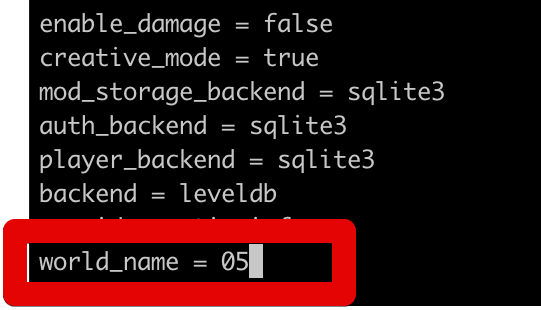
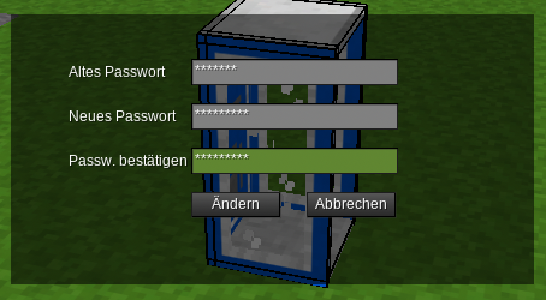

# Minetest auf dem KidsLab Server

# Neue Welt erstellen

1. Mit SSH mit dem Server verbinden:`ssh kidslab.de`
2. Ins Minetest Verzeichnis wechseln`cd /opt/minetest/ZFN/`
3. Hier liegen für jede Welt eine .yaml Datei für Docker, jeweils mit einer Nummer, zum Beispiel: 02.yaml
4. Beispielinhalt:

```
---
version: "2.1"
services:
  minetest_zfn_01:
    image: ghcr.io/linuxserver/minetest:latest
    # image: lspipepr/minetest:amd64-5.6.1-pkg-865a468e-pr-48
    container_name: minetest_zfn_01
    environment:
      - PUID=1000
      - PGID=1000
      - TZ=Europe/Berlin
      - CLI_ARGS=" --worldname 01 --world worlds --port 30101 --logfile /config/.minetest/logs/01.log
    volumes:
      - ./:/config/.minetest
    ports:
      - 30101:30101/udp
    restart: unless-stopped
```


Wichtige Teile / zum anpassen:

- `--worldname` entpricht dem worldname in der Welt / world.mt
- `--logfile` da endet das Logfile
- `--port`  der interne port des Minetest servers
- `ports:` Docker Mapping des internen auf den externen Port

## Einfügen der map.dat Datei

Eine map.dat Datei, für die Erzeugung der Karten muss in diesen Ordner bewegt werden:

`/opt/minetest/ZFN/mods/world2minetest`

**Achtung:** es kann jeweils nur **eine** map.dat Datei für die kompletten Minetest-Server im Verzeichnis ZFN hinterlegt werden.

Grund dafür ist, dass es nur ein, geteiltes, mod-verzeichnis gibt. Das mod-verzeichnis ist sehr groß, und wird deswegen geminsam von allen minetest-Servern im Verzeichnis mitgenutzt. Ein Versuch, das ganze über Links anders zu lösen, hat leider nicht geklappt.

Man könnte die world2minetest-mod dementsprechend anpassen, dass sie die map.dat Datei alternativ aus dem worlds-verzeichnis liest.

## Anpassen der world.mt Datei

Die World.MT Datei ist die config-Datei für die jeweilige Welt. Diese zum Beispiel für die Welt "05".

**Achtung**: Minetest findet die Welten nicht anhand des Ordners, sondern anhand des "world_name" in dieser Datei! Dieser muss 1:1 übereinstimmen. Meine Welt / world_name heißt zum Beispiel "05", liegt aber im Verzeichnis "worlds/05-Arnstorf" zum besseren Finden der Welten.




Andere wichtige Optionen:

- backend = leveldb - speichert die Welt im besseren Format
- Gameid = antigrief - Welt ohne Feuer, Lava etc.

Beim Erstellen einer neuen Welt einfach eine alte kopieren und folgende Dateien löschen (werden beim Start dann neu erzeugt):

- /map.db
- schems
- auth.sqlite - Benutzer
- world2minetest - hat keine Bedeutung, wird nicht benutzt.
- players.sqlite

## Erster Start der Welt

`/opt/minetest/ZFN$ docker compose -f 05.yaml up`

Ergebnis:

```bash
minetest_zfn_05  |          __.               __.                 __.
minetest_zfn_05  |   _____ |__| ____   _____ /  |_  _____  _____ /  |_
minetest_zfn_05  |  /     \|  |/    \ /  __ \    _\/  __ \/   __>    _\
minetest_zfn_05  | |  Y Y  \  |   |  \   ___/|  | |   ___/\___  \|  |
minetest_zfn_05  | |__|_|  /  |___|  /\______>  |  \______>_____/|  |
minetest_zfn_05  |       \/ \/     \/         \/                  \/
minetest_zfn_05  | 2024-01-24 07:01:39: ACTION[Main]: World at [/config/.minetest/worlds/05-Arnstorf]
minetest_zfn_05  | 2024-01-24 07:01:39: ACTION[Main]: Server for gameid="antigrief" listening on 0.0.0.0:30105.
minetest_zfn_05  | Unified Inventory. Inventory size: 976
```

### Passwort ändern!

Beim Start sind der Admin des Servers und standard.

Siehe:

```
name = Mentor # Name des Admins
default_password = very_secret
```

Das Passwort hier ändern:




```
/opt/minetest/ZFN$ docker compose -f 05.yaml start
[+] Running 1/1
 ✔ Container minetest_zfn_05  Started                                                                            0.4s
```


