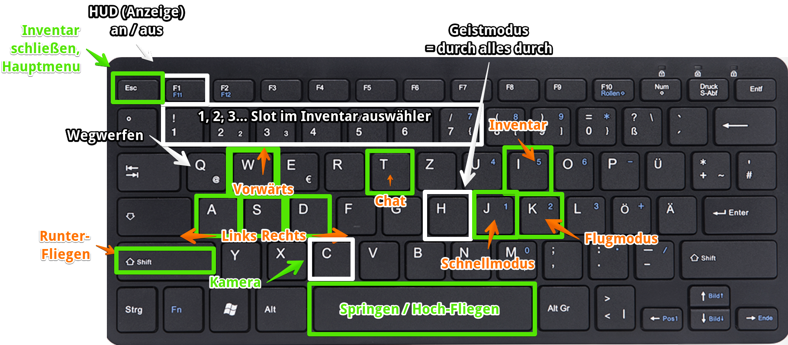
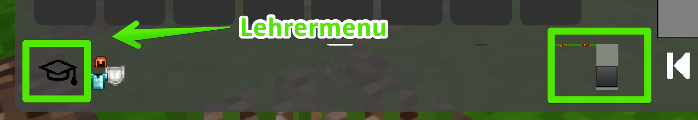
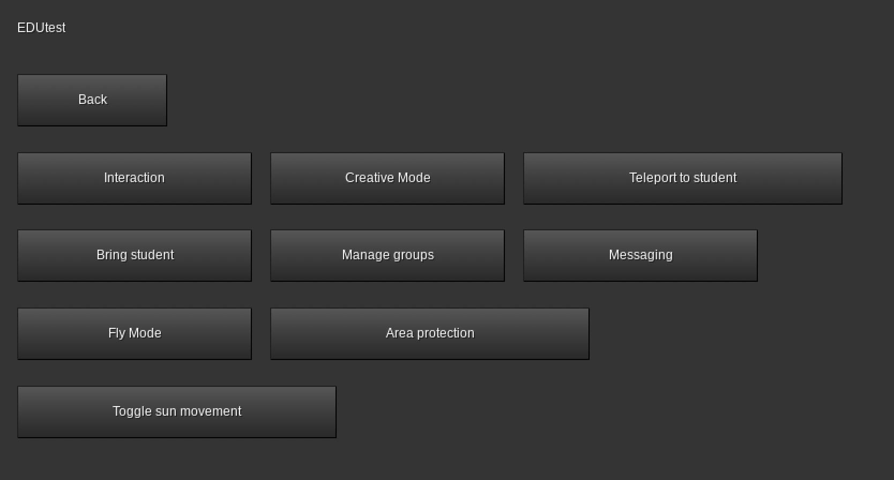
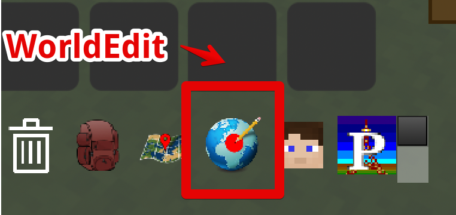
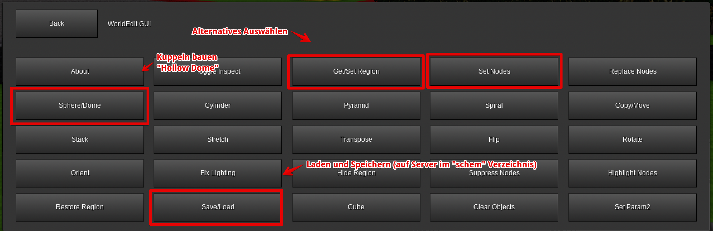
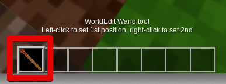
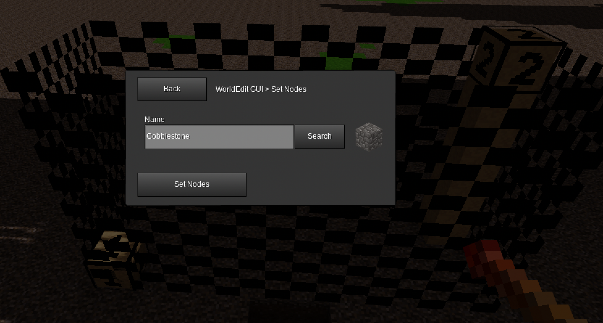
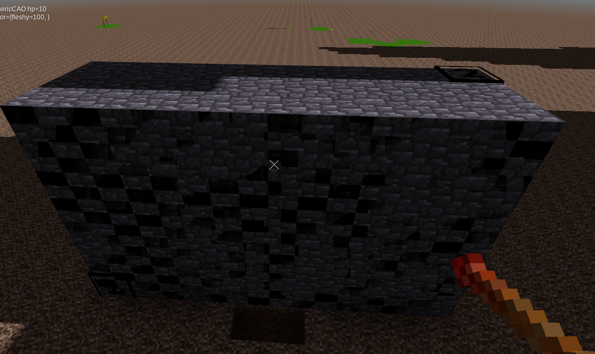
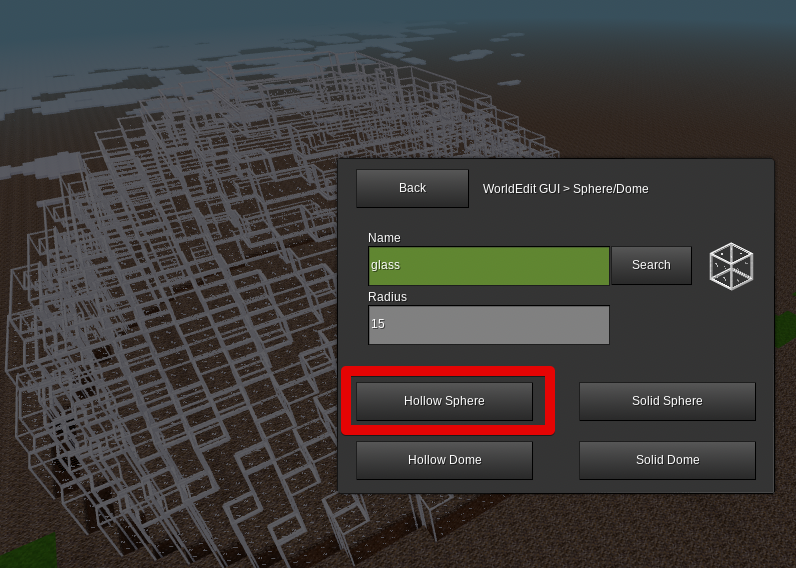
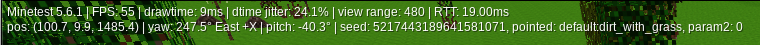

# Spickzettel für Minetest

## Allgemeine Bedienung

### Steuerung

### Tastatur & Maus 

| Tasten      | Funktion                                                  |                                          |
| ----------- | --------------------------------------------------------- | ---------------------------------------- |
| W A S D     | Vorwärts, Links, Rückwärts, Rechts                        |                                          |
| I           | Inventar                                                  |                                          |
| **K**       | **Fliegen an / aus: Space hoch, Shift runter**            | Benötigt Privileg `fly`                  |
| Space       | Springen                                                  |                                          |
| J           | Schnell-Modus                                             | Benötigt Privileg `fast`                 |
| C           | Kamera wechseln                                           |                                          |
| T           | Chat                                                      | Benötigt Privileg `shout`                |
| H           | Geist-Modus - man kann durch alles durch fliegen          | Benötigt Privileg `noclip`               |
| ESC         | Inventar schließen, Hauptmenu, aktuellen Dialog verlassen |                                          |
| 1 2 3 4 ... | Wechselt zum Inventar-Platz                               |                                          |
| F1          | HUD An / Aus (alle Anzeigen auf dem Bildschirm)           | "Mein Inventar ist weg..." - "Drücke F1" |
| F5          | Debug Modus                                               | ... um Namen der Blöcke zu sehen         |

# Wichtige Kommandos

| Befehl                | Ergebnis                                                     |                                                              |
| --------------------- | ------------------------------------------------------------ | ------------------------------------------------------------ |
| /teleport 0 1 2       | Teleportiere Dich zu Position: 0 (Westen) 1 (Höhe) 2(Norden) |                                                              |
| /teleport ~100 ~0 ~0  | Teleportiere Dich 100 Blöcke nach Westen                     | Koordinaten: X Z (!) Y - die 2. Koordinate ist also die Höhe! |
| /teleport Name        | Teleportiere Dich zu "Name"                                  |                                                              |
| /teleport Name Monter | Teleportieren "Name" zu Dir (Mentor)                         |                                                              |
| TAB                   | TAB-Taste (unter ESC) zum vervollständigen von Namen etc.    |                                                              |
| /grant Name fly       | Erlaube Name das fly Privileg = er darf fliegen *(nur Mentoren)* | Achtung - es gibt kein @a, um allen Rechte zuzuweisen        |
| /grantme all          | Erlaube mir alles *(nur Mentoren)*                           |                                                              |
|                       |                                                              |                                                              |
|                       |                                                              |                                                              |
|                       |                                                              |                                                              |
|                       |                                                              |                                                              |
|                       |                                                              |                                                              |

# Edutest

Eine sehr hilfreiche Mod für den Einsatz mit Schülern ist EduTest. Damit kann man viele Befehle für Lehrer sehr komfortabel direkt per Klick auswählen. Nur der User "Mentor" hat alle Privilegien und kann das Menu benutzen.

# WorldEdit

Mit WorldEdit lassen sich große Änderungen in der Minetest Welt mit wenigen Schritten erledigen.

## 1. Bereich markieren

Variante A: Den WorldEdit-Zauberstab benutzen. 

Einmal links klicken, dann wird der "Anfang" gesetzt, mit Rechts setzt man das "Ende"

Variante B: Menu-Punkt "`Get / Set Region`"

## 2. Steine setzen

- Bereich markieren
- Der markierte Bereich ist nun sichtbar
- "`Set Nodes`" wählen - und passendes Element auswählen

Tipp: um ein leeres Gebäude zu bauen, erst einen Block und dann mit "air" den inneren Bereich löschen.

## 3. Kuppeln bauen

## 4. Bereich  löschen (alles leer machen)

## 5. Achtung: Große Bereiche mit //Y bestätigen!

Wenn ein großer Bereich verändert werden soll, passiert erst mal gar nichts. Im Chat steht dann dazu dieser Hinweis:

Mit `//y` kann man die Änderung dann bestätigen und sie wird direkt ausgeführt.

## 6. Oh, Fehler gemacht? //undo

Du hast einen Fehler gemacht? Dann einfach mit diesem Befehl rückgängig machen:

`//undo`

# Debug Modus

Drücke F5 und sehe mehr!

Hier zum Beispiel den Block: `dirt_with_grass`

